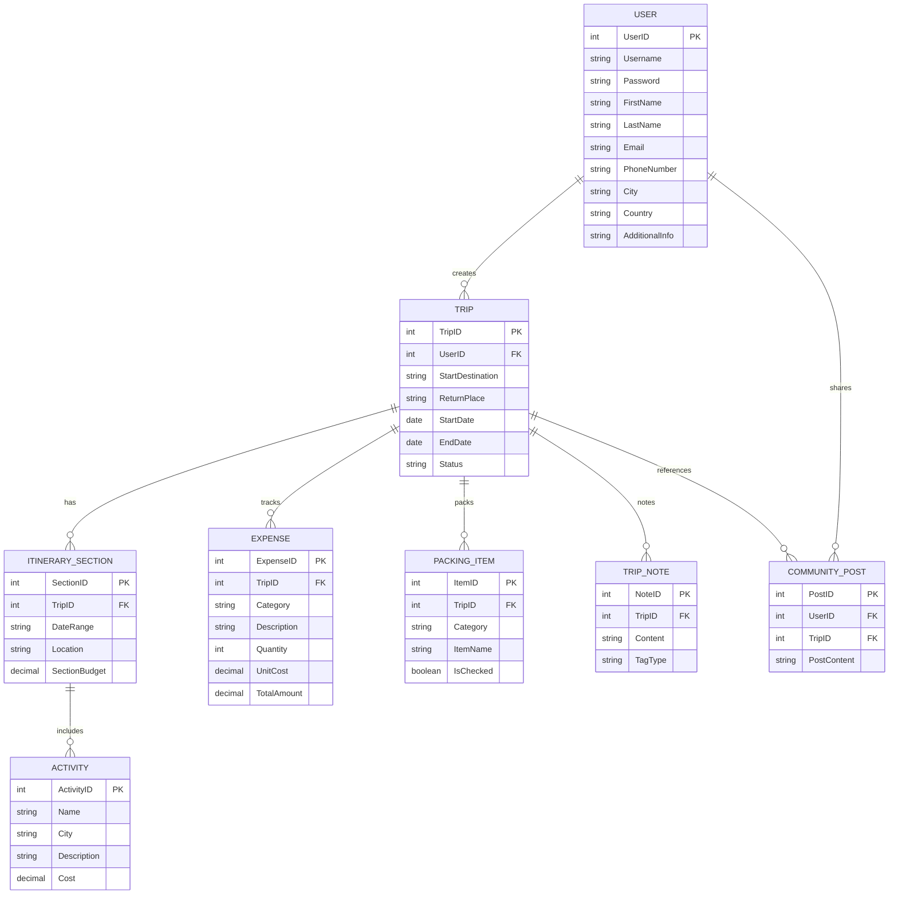
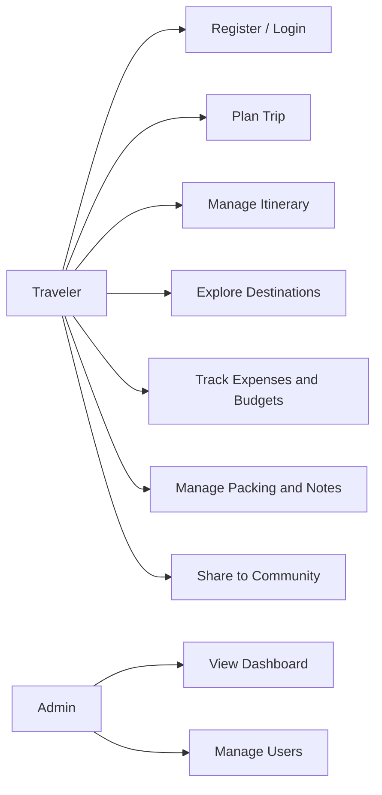
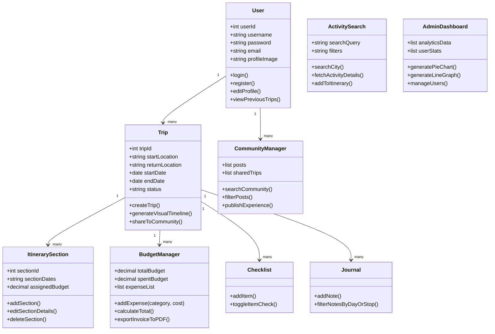

# Software Requirements Specification (SRS)

## 1. Introduction
### 1.1 Purpose
This document defines functional and nonfunctional requirements for Traveloop, a multi-city travel planning application. It aligns with the provided wireframe screens and the Traveloop.pdf brief.

### 1.2 Scope
Traveloop enables travelers to plan, manage, and share multi-city itineraries. It supports trip creation, itinerary building, activity discovery, budgeting, packing checklists, trip notes, and community sharing. Administrators can monitor platform usage and manage users.

### 1.3 Definitions, Acronyms, and Abbreviations
- User or Traveler: Primary end user who plans trips.
- Trip: A multi-city travel plan with dates, destinations, and sections.
- Itinerary Section or Stop: A grouped segment of a trip (city or date range).
- Activity: An experience or event tied to a stop.
- Expense or Invoice: Cost items for budgeting and reporting.
- SRS: Software Requirements Specification.

### 1.4 References
- Traveloop.pdf (project brief and screen descriptions)
- Wireframe screen list provided by stakeholder summary

### 1.5 Overview
Sections 2-7 describe system context, functional features, data model, and diagrams.

## 2. Overall Description
### 2.1 Product Perspective
Traveloop is a web-first application with responsive layouts for mobile. It uses a relational database to store user profiles, trips, itinerary sections, activities, expenses, checklists, notes, and community posts.

### 2.2 Product Functions
- User registration and login
- Trip creation and trip list management
- Itinerary building and timeline visualization
- City and activity search
- Budget estimation and expense tracking
- Packing checklist management
- Trip notes and journal entries
- Community sharing and discovery
- Admin analytics and user management

### 2.3 User Classes and Characteristics
- Traveler: Plans trips, manages itineraries, budgets, and shares posts.
- Admin: Oversees users, analytics, and platform content health.

### 2.4 Operating Environment
- Web application running on modern browsers (Chrome, Edge, Safari).
- Backend API with relational database (SQL-based).
- Optional mobile web support via responsive UI.

### 2.5 Design and Implementation Constraints
- Relational data model is required for complex trip structures.
- User data must be protected with secure authentication and access control.
- Budget calculations must be consistent and auditable.

### 2.6 Assumptions and Dependencies
- External data sources may be used for city and activity search.
- Users have basic internet connectivity to access features.

## 3. System Features and Requirements
### 3.1 Account Management
**Description:** Registration, login, and profile management.
**Functional Requirements:**
- Users can register with email and password.
- Users can log in and log out securely.
- Users can edit profile details and preferences.

### 3.2 Trip Planning
**Description:** Create and manage trips with dates and destinations.
**Functional Requirements:**
- Users can create a trip with name, start/end dates, and description.
- Users can view a list of their trips with summary details.
- Users can open, edit, or delete existing trips.

### 3.3 Itinerary Management
**Description:** Build day-by-day or stop-by-stop itineraries.
**Functional Requirements:**
- Users can add itinerary sections with date ranges and locations.
- Users can reorder, edit, or delete sections.
- Users can view a timeline or grouped itinerary view.

### 3.4 Destination and Activity Discovery
**Description:** Search for cities and activities and add them to a trip.
**Functional Requirements:**
- Users can search for cities and view destination metadata.
- Users can search for activities by category, cost, and duration.
- Users can add activities to itinerary sections.

### 3.5 Budgeting and Expense Tracking
**Description:** Track costs and visualize spending.
**Functional Requirements:**
- Users can record expenses by category and quantity.
- Users can view daily and total cost breakdowns.
- Users can export invoices or summaries.

### 3.6 Packing Checklist
**Description:** Manage trip packing items by category.
**Functional Requirements:**
- Users can add, remove, and categorize checklist items.
- Users can mark items as packed or unpacked.

### 3.7 Trip Notes and Journal
**Description:** Capture notes by day or stop.
**Functional Requirements:**
- Users can add and edit notes tied to a trip or section.
- Users can filter notes by day or stop.

### 3.8 Community Sharing
**Description:** Share trips and view community posts.
**Functional Requirements:**
- Users can publish trip summaries to a community feed.
- Users can view shared trips and copy them.

### 3.9 Admin Dashboard
**Description:** Monitor analytics and manage users.
**Functional Requirements:**
- Admins can view usage analytics and trip statistics.
- Admins can manage user accounts and content.

## 4. External Interface Requirements
### 4.1 User Interfaces
- Login and signup screen
- Dashboard with trip list and recommendations
- Trip creation and itinerary builder views
- Search interfaces for cities and activities
- Budget and invoice summary views
- Packing checklist and notes screens
- Community sharing screen
- Admin analytics dashboard

### 4.2 Software Interfaces
- Authentication service for user sessions
- Data service for trips, itineraries, and expenses
- Optional third-party APIs for destination data

### 4.3 Communications Interfaces
- HTTPS for all client-server traffic

## 5. Nonfunctional Requirements
### 5.1 Performance
- Common views should load within 2 seconds under normal load.
- Budget summaries should update within 1 second after changes.

### 5.2 Security and Privacy
- Passwords are stored using strong hashing.
- Access control restricts data to owners and admins.

### 5.3 Usability
- Mobile-responsive layout with touch-friendly controls.
- Clear progress indicators for multi-step trip creation.

### 5.4 Reliability and Availability
- No loss of itinerary or budget data on refresh.
- Graceful handling of network errors.

### 5.5 Maintainability
- Clear separation of UI, business logic, and data access layers.
- Well-defined APIs for feature modules.

## 6. Data Requirements
### 6.1 Entities and Attributes
- User: UserID (PK), Username, Password, FirstName, LastName, Email, PhoneNumber, City, Country, AdditionalInfo
- Trip: TripID (PK), UserID (FK), StartDestination, ReturnPlace, StartDate, EndDate, Status
- ItinerarySection: SectionID (PK), TripID (FK), DateRange, Location, SectionBudget
- Activity: ActivityID (PK), Name, City, Description, Cost
- Expense: ExpenseID (PK), TripID (FK), Category, Description, Quantity, UnitCost, TotalAmount
- PackingItem: ItemID (PK), TripID (FK), Category, ItemName, IsChecked
- TripNote: NoteID (PK), TripID (FK), Content, TagType
- CommunityPost: PostID (PK), UserID (FK), TripID (FK), PostContent

### 6.2 Relationships
- User to Trip: One-to-Many
- Trip to ItinerarySection: One-to-Many
- ItinerarySection to Activity: One-to-Many
- Trip to Expense, PackingItem, TripNote: One-to-Many
- User to CommunityPost: One-to-Many

## 7. Diagrams
### 7.1 Entity-Relationship (ER) Diagram

### 7.2 Use Case Diagram

### 7.3 Class Diagram

